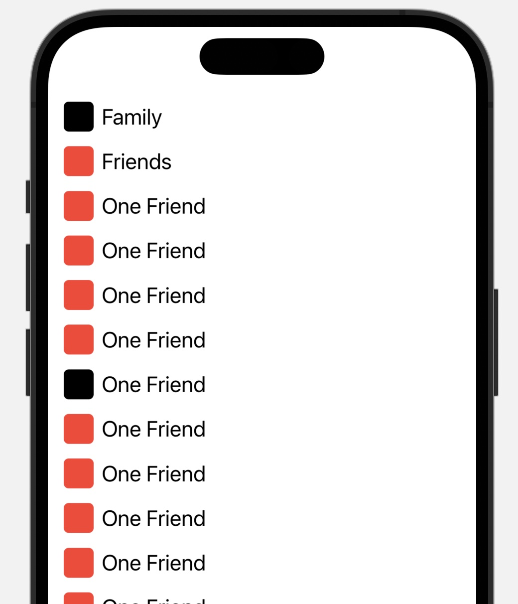

#  Snapse

Snapse is a Snapchat-like client for Matrix.org. To get my friends and family to use the Matrix.org-network I saw a clear need; Snapchat and easy image sharing. Element, FluffyChat etc are focused on text based chats. I wanted to create an easy-to-use, quick, image oriented client. So this is my attempt.

## Help needed

Because lack of time, experience and all that. Please help me. 

Contact me [https://matrix.to/#/@olekenneth:ablo.xyz](https://matrix.to/#/@olekenneth:ablo.xyz)

## Screenshots

